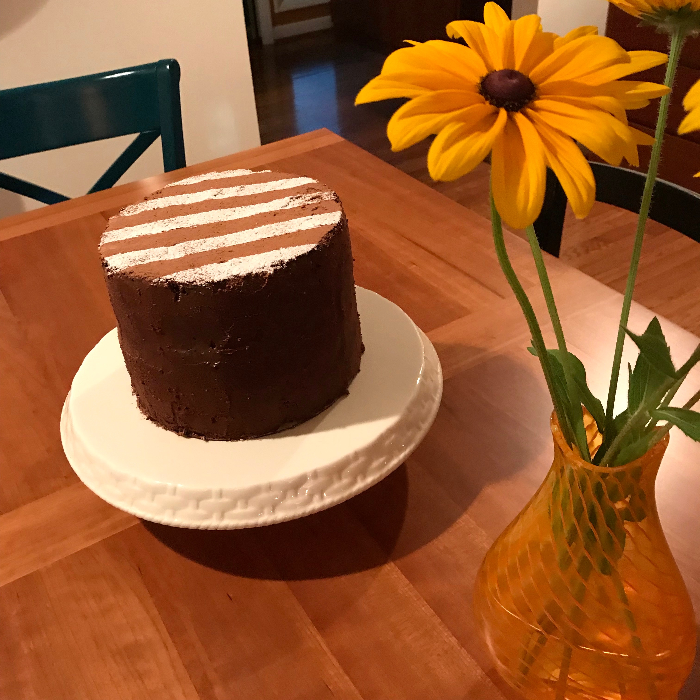

<head>

</head>
<h3>Personal Projects and Media (click images) </h3>

  
 

  
 

  
 

  
 <i>Pokémon Orange & Blue</i> is a version of the Pokémon games themed around my undergraduate university: Bucknell.  It is written in Java and was created by myself and 3 good friends of mine.  As we are all avid fans of Pokémon, our goal was to create something that looked and felt like one of the original games.  Among other things, this project was an exercise in the Agile Scrum methodology. The above Pokéball links to a .jar file of the game, which requires an updated version of Java to run. 

  
 I worked on a software team with three other coders on a project commissioned by Bucknell's Griot Institute (for Africana Studies) to help create an interactive map to creatively display the history of the sugar mills of Antigua.  This was done using an agile/scrum methodology and relied heavily on the previous expertise of our team members.  The main vision of this project was to provide a visually-pleasing way to present the history of the African Diaspora in Antigua.  

  
 <i>Visual Disturbances</i> was an interdisciplinary project amongst people in the Mathematics, Computer Science, Psychology, and Film & Media Studies fields.  I was in charge of the data analysis and visualizations for this project and provided major contributions to the upcoming paper (see publications). 

  
 

    
 

    
 

  
 <i>Caught</i> is a short film written, directed, and produced by myself and my good friend <a href = "https://www.facebook.com/profile.php?id=100006014850247&lst=1738819438%3A100006014850247%3A1590249633&sk=timeline">Alex Gao</a> for a 24-hour horror film competition.  A very special thanks to our leading lady: <a href = "https://www.facebook.com/hannah.brigette">Hannah Rickertsen</a>!  After a very fun and <i>very</i> late night, we won first place (and the cash price)! Our film was screened at the beautiful <a href = "https://www.campustheatre.org">campus theatre</a> and can be watched on YouTube (click image). 
  

<h3>Cakes</h3>
<body>

  
  
Gingerbread cake with spiced Italian meringue buttercream and candied cranberries. 

  
  
Prinsesstårta: Swedish vanilla sponge with pastry cream and homemade raspberry jam. 

  
  
Prinsesstårta (inside). 

  
  
Carrot Cake with cream cheese icing and marzipan carrots. 

  
  
Guiness Stout Cake: Deep chocolate layer cake. 

  
  
S'mores Cake: Chocolate cake with marshmallow fluff buttercream and graham cracker crumble. 

  
  
Tiramisu Cake: Chocolate cake soaked in fresh espresso and iced with whipped cream. 

  
  
Croquembouche: tower of homemade cream puffs held together by caramel. 

  
  
Black Forest Cake: Chocolate cake with a cherry compote, cherry liquor, and whipped cream icing. 

  
  
My first wedding cake!  Chocolate cake with peppermint Swiss meringue buttercream and chocolate ganache.  Congrats Meredith and Mario! 

  
  
Chocolate with chocolate buttercream and chocolate ganache.  A small cake made with the scraps leftover from the wedding cake. 

</body>
<!--

 
  

    
  

  

    
  
 

-->
<!--
<ul class="posts">
  
    <li>{{ post.date | date_to_string }} &raquo; <a href="{{post.url}}">{{ post.title }}</a></li>
  
</ul>
-->
